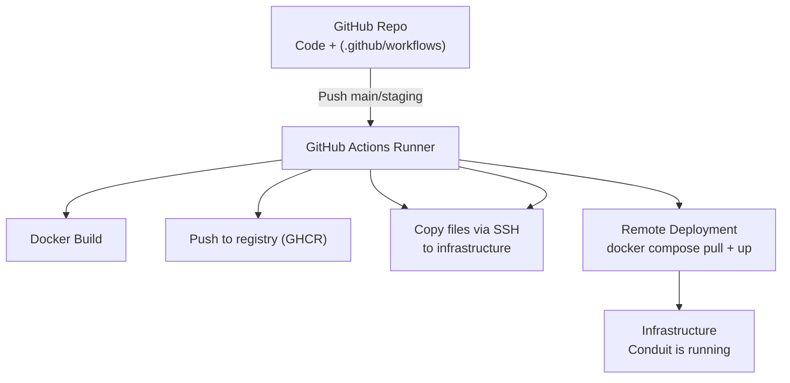

# 🚀 CI/CD with GitHub Actions, Docker Compose and V-Server Deployment

This project demonstrates how to containerize an **Angular frontend app** and a **Django backend app** using **Docker Compose**.  
Build and deployment are fully automated via **GitHub Actions**.



## 📂 Project Structure

```shell
.
├── .github/
│   └── workflows/
│       └── deployment.yml   # CI/CD Workflow
├── conduit-frontend/        # Angular Frontend
│   └── Dockerfile
├── conduit-backend/         # Django Backend
│   └── Dockerfile
├── compose.yml              # Base Compose file (local)
├── docker-compose.prod.yml  # Compose for production deployment
├── .env                     # Local development environment
```

## ⚙️ CI/CD Workflow with GitHub Actions

The CI/CD pipeline runs in three stages:

### 1. Build & Push Images

- Frontend and backend are built with their respective Dockerfiles.  
- Images are pushed to the **GitHub Container Registry (GHCR)**.  
- The variables `SERVERIP` and `BACKEND_PORT` are passed as **build args** to the frontend build to generate `environment.ts`.

### 2. Deployment to the V-Server

- GitHub Actions connects to the server via **SSH**.  
- The `docker-compose.prod.yml` is transferred.  
- A `.env.prod` file is created **on the fly** from GitHub Secrets (no `.env.prod` in the repo).  

### 3. Start the Containers

- On the V-Server, `docker compose -f docker-compose.prod.yml up -d` is executed.  
- Both frontend and backend run in production mode.

## 🔑 Handling Secrets

To avoid committing sensitive data, use **GitHub Secrets**:

- `SERVERIP`
- `FRONTEND_PORT`
- `BACKEND_PORT`
- `DJANGO_SU_NAME`
- `DJANGO_SU_EMAIL`
- `DJANGO_SU_PASSWORD`
- `ALLOWED_HOSTS`
- `SECRET_KEY`
- `DEBUG`
- `DEPLOYMENT_KEY` (private SSH key for deployment user)

⚠️ Important:  
All values from `.env` must be added as GitHub Secrets under the **same keys**.  
The `.env.prod` file is dynamically created during deployment.

## 🛠️ Local Testing

For local development:

```bash
docker compose up --build
```

👉 Then:  

- Frontend runs at `http://localhost:8282`  
- Backend runs at `http://localhost:8000`

## 📦 Deployment Workflow

1. Push to the `main` branch.  
2. GitHub Actions automatically triggers `deployment.yml`.  
3. Images are built and pushed to **GHCR**.  
4. Via SSH, `docker-compose.prod.yml` + `.env.prod` are deployed to the V-Server.  
5. Containers start automatically.  

## 🎯 Advantages of this Setup

- No secrets in code – all handled via GitHub Secrets.  
- No `.env.prod` in the repo – it’s auto-generated.  
- Fully automated deployment – no manual copying needed.  
- Easy scalability – add more services to Compose anytime.  

✅ With this, you now have a complete pipeline:  

- Local testing with `compose.yml`  
- Deployment via GitHub Actions + `docker-compose.prod.yml`  
- Secure secrets management  